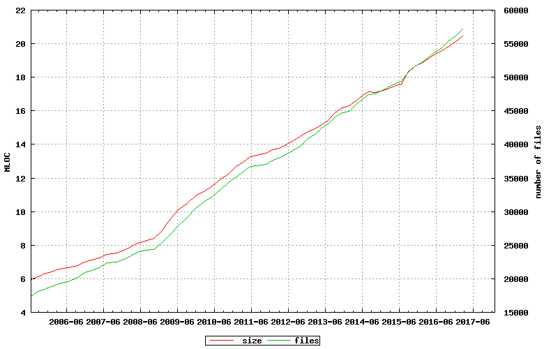

# Linux kernel code base size statistics

A script to figure out [Linux kernel](https://github.com/torvalds/linux) code base statistics, just for fun.

## Running

```
# clone the scripts
$ cd /tmp
$ git clone https://github.com/ykarikos/linux-statistics.git

# clone Linux kernel
$ cd /tmp
$ git clone https://github.com/torvalds/linux.git

# run the scripts
$ ~/linux-statistics/linux-statistics.sh >~/linux-statistics/linux-statistics.txt

# take a coffee...

# run gnuplot
$ cd ~/linux-statistics
$ gnuplot linux-statistics.gnuplot
```

## Output



## License 

Copyright © 2017 Yrjö Kari-Koskinen ykk@peruna.fi

linux-statistics source code is licensed with the MIT License, see 
[LICENSE.txt](https://github.com/ykarikos/linux-statistics/blob/master/LICENSE.txt)

